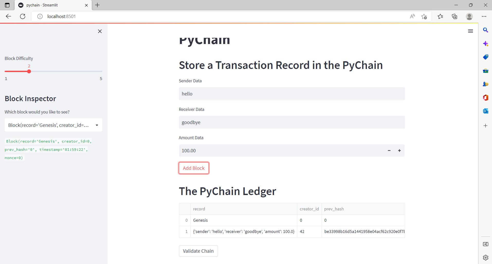

# Blockchain - Streamlit Application

The application in `pychain.py` contains a basic ledger structure for a blockchain application (pychain). From your localhost address, the application is displayed so that the user can type in various input parameters and see the results written to the blockchain ledger. 

## Technologies

This program is written in Python (3.7.13) and developed in VS Code on a Windows computer. Additional libraries used in this application are streamlit, pandas, ast, dataclasses, typing, datetime, and hashlib.

## Installation Guide

Downloading the code & associated files using `git clone` from the repository is sufficient to download the Jupyter Notebook, ensure that the associated libaries (see Technologies section) are installed on your machine as well.  

## Usage

After activating your development environment, you can run the application simply by typing `streamlit run pychain.py` from your command line. Make sure that you're in the root folder for the application and that your development environment with streamlit and other associated libraries are installed. 

After running the application, your default browser should show you the application from your localhost address.

Here is what the application looks like: 

## Contributors

Project contributors are the Rice FinTech bootcamp program team (instructor Eric Cadena) who developed the tasks for this project along with myself (Paula K) who's written the code in the workbook.
